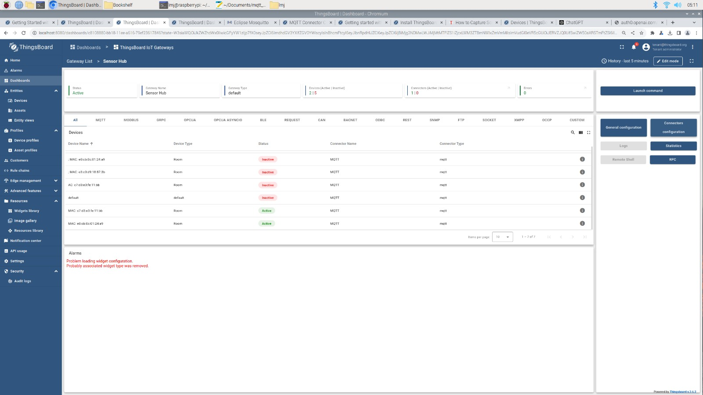

# Group4IoTW23

Our project implements the system infrastructure presented during the lectures of Internet of Things (TU Wien, W23-24) which comprises of interconnecting several smart devices with the scope of real-time monitoring.
We decided to broadcast data given by the temperature sensor data of the Nordic Semiconductor’s Thingy52 via BLE to our ESP32 microcontroller. Using the MQTT protocol and the MQTT broker Mosquitto, we enabled the communication between ESP32 onto a designated topic for our Raspberry Pi, on which we can visualise incoming information using Thingsboard.

- Use commands west build/west flash to flash the zephyr code to the Thingy52's.

- Use Arduino IDE to upload the code to the ESP32.

- Configure the Raspberry PI3 use MQTT, install Thingsboard and Docker.

We used Mosquitto as the MQTT broker.The steps to configure Mosquitto on Raspberry Pi are the following:
- Install required packages: |sudo apt-get install mosquitto mosquitto-clients -y|
- Configure MQTT broker: |sudo nano /etc/mosquitto/mosquitto.conf|
- Start Mosquitto service: |sudo service mosquitto start|

We configured our dashboard to dynamically display the temperature data it's receiving from each Thingy52.

For this we implemented an IoT Gateway in which we applied a topic filter for the temperature topic. The steps are as follows:
- Install Docker image for gateway from source, following this guide: https://thingsboard.io/docs/iot-gateway/getting-started/
- Create "Sensor Hub" device in the Iot Gateway dashboard:
- Add MQTT connector, with the following config file: mqtt_connector.conf. This subscribes to any topic that contains "/temperature" that's passed through our MQTT broker, and creates a new ThingsBoard device for each topic (each topic "\[address\]/temperature" represents temperature data from a specific Thingy).

Notes:
An issue that took a very long time to debug was an Arduino IDE issue. When uploading our code to the ESP32, we were getting an exceeded memory usage error. This was caused by the library size of Arduino and the solution was: Arduino IDE: Tools -> Partition Scheme:change "Default" to "Huge APP(3MB No OTA)": https://github.com/SensorsIot/Bluetooth-BLE-on-Arduino-IDE/issues/3